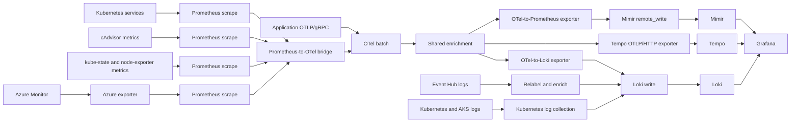
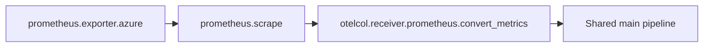

# Grafana Alloy on AKS — Azure telemetry to LGTM

## Purpose

This structure uses one shared Alloy configuration and optional service snippets.

- `aks_alloy.alloy` contains receivers, processors, enrichment, Kubernetes collection and direct LGTM exports.
- `services/azure-monitor/` contains optional Azure Monitor metric collectors.
- `services/event-hubs/` contains optional Azure Event Hub log collection.
- `services/kubernetes/` contains optional Kubernetes logs, events and cluster/node metrics.
- A service starts working after its complete snippet is appended to `aks_alloy.alloy` and its placeholders are replaced.

## Data flow



Metrics, traces and logs use separate backend endpoints. Optional files reuse the matching destination from the main file.

## Main file

`aks_alloy.alloy` provides:

1. OTLP/gRPC receiver for application metrics, traces and logs.
2. Shared batching and Alloy/CMDB/cluster enrichment.
3. Resource-attribute conversion for metrics and logs.
4. Mimir Prometheus remote_write destination.
5. Tempo OTLP/HTTP destination.
6. Loki write destination.
7. Kubernetes service discovery and Prometheus scraping.
8. cAdvisor collection through the Kubernetes API server.
9. Shared Prometheus-to-OTel bridge used by all metric snippets.

Replace these values in the main file:

| Placeholder | Source |
|---|---|
| `<MIMIR_REMOTE_WRITE_ENDPOINT>` | Mimir remote_write URL from LGTM/platform team |
| `<TEMPO_OTLP_HTTP_ENDPOINT>` | Tempo OTLP/HTTP URL from LGTM/platform team |
| `<LOKI_PUSH_ENDPOINT>` | Loki push URL from LGTM/platform team |

## Add Azure service monitoring

1. Open the required file under `services/`.
2. Copy the entire file.
3. Paste it at the bottom of `aks_alloy.alloy`.
4. Replace every uppercase `<PLACEHOLDER>`.
5. Validate the completed configuration.
6. Deploy it as the Alloy configuration.

### Service files

Replace each `<ADD_LINK_...>` value after publishing the files.

| Service | Data | File |
|---|---|---|
| Virtual Machines | Azure Monitor metrics | [Open file](<ADD_LINK_VIRTUAL_MACHINES>) |
| SQL Database | Azure Monitor metrics | [Open file](<ADD_LINK_SQL_DATABASE>) |
| SQL Managed Instance | Azure Monitor metrics | [Open file](<ADD_LINK_SQL_MANAGED_INSTANCE>) |
| Service Bus | Azure Monitor metrics | [Open file](<ADD_LINK_SERVICE_BUS>) |
| Event Hubs | Platform metrics | [Open file](<ADD_LINK_EVENT_HUB_METRICS>) |
| Event Grid | Azure Monitor metrics | [Open file](<ADD_LINK_EVENT_GRID>) |
| Logic Apps Consumption | Azure Monitor metrics | [Open file](<ADD_LINK_LOGIC_APPS_CONSUMPTION>) |
| Logic Apps Standard | Azure Monitor metrics | [Open file](<ADD_LINK_LOGIC_APPS_STANDARD>) |
| Redis Cache | Azure Monitor metrics | [Open file](<ADD_LINK_REDIS_CACHE>) |
| Cosmos DB | Azure Monitor metrics | [Open file](<ADD_LINK_COSMOS_DB>) |
| Databricks | System Table metrics | [Open file](<ADD_LINK_DATABRICKS>) |
| Storage Accounts | Account metrics | [Open file](<ADD_LINK_STORAGE_ACCOUNTS>) |
| Azure Files | File service metrics | [Open file](<ADD_LINK_STORAGE_FILES>) |
| Blob Storage | Blob service metrics | [Open file](<ADD_LINK_STORAGE_BLOBS>) |

Each Azure Monitor file collects its listed metrics from **all accessible resources matching its `resource_type` in every configured subscription**. It does not collect unlisted metrics or other resource types. Logic Apps Standard is additionally restricted to `workflowapp` resources. Databricks targets the configured workspace and warehouse.

For multiple subscriptions:

```alloy
subscriptions = ["subscription-one", "subscription-two"]
```

### Azure Monitor metrics

Every Azure Monitor snippet follows the same path:



Find `<AZURE_SUBSCRIPTION_ID>` in Azure Portal:

**Subscriptions → select subscription → Overview → Subscription ID**

The snippets use Azure Resource Graph discovery. Region values are not required.

### Databricks metrics

Find values through Azure Portal and the Databricks workspace:

| Placeholder | Location |
|---|---|
| `<DATABRICKS_WORKSPACE_HOSTNAME>` | **Azure Databricks → workspace → Overview → Workspace URL**, without `https://` |
| `<DATABRICKS_SQL_WAREHOUSE_HTTP_PATH>` | **Launch Workspace → SQL → SQL Warehouses → warehouse → Connection details → HTTP path** |
| `<DATABRICKS_CLIENT_ID>` | **Microsoft Entra ID → App registrations → application → Application (client) ID** |
| `<DATABRICKS_CLIENT_SECRET>` | **App registration → Certificates & secrets → Client secrets** |

Databricks also requires Unity Catalog, System Tables, a running SQL Warehouse and OAuth2 M2M access.

## Add Kubernetes metrics

Append only the required metric files from `services/kubernetes/` to `aks_alloy.alloy`. They reuse the shared Mimir destination.

| Collection | Provides | Requirement | File |
|---|---|---|---|
| kube-state-metrics | Pod, workload and Kubernetes object state | kube-state-metrics installed | [Open file](<ADD_LINK_KUBE_STATE_METRICS>) |
| node-exporter | Host CPU, memory, disk and network metrics | node-exporter installed on every node | [Open file](<ADD_LINK_NODE_EXPORTER>) |

The main file already collects cAdvisor container CPU, memory, filesystem and network metrics. It does not replace kube-state-metrics for object state or node-exporter for host operating-system metrics.

### Kubernetes metric exporters

kube-state-metrics and node-exporter are separate exporters; Alloy scrapes them but does not install them.

Replace:

| Placeholder | Source |
|---|---|
| `<KUBE_STATE_METRICS_SERVICE>` | Kubernetes Service name for kube-state-metrics |
| `<KUBE_STATE_METRICS_NAMESPACE>` | Namespace containing that Service |
| `<KUBE_STATE_METRICS_PORT>` | Service metrics port, commonly `8080` |
| `<NODE_EXPORTER_APP_LABEL>` | Value of pod label `app.kubernetes.io/name` |
| `<NODE_EXPORTER_PORT_NAME>` | Named metrics port on the node-exporter pod |

Both metric snippets feed `otelcol.receiver.prometheus.convert_metrics` from the main file and then use the shared Mimir pipeline.

## Logging

Pod logs, Kubernetes Events, node journals, AKS control-plane logs and Event Hub logs are documented separately:

**[Open the logging guide](alloy-aks-logging-guide.md)**

## Azure identity and permissions

Alloy Azure components use Azure SDK credentials supplied to the Alloy runtime. Do not store Azure credentials in `.alloy` files.

### Portal setup

1. Open the subscription or required resource scope.
2. Open **Access control (IAM) → Add role assignment**.
3. Assign **Monitoring Reader** to the identity used by Alloy.
4. Confirm the identity can read selected resources through Azure Resource Graph and has `Microsoft.Insights/Metrics/Read`.

### Authentication options

Use either:

- AKS Workload Identity with a managed identity and federated credential; or
- App registration credentials exposed to the Alloy container as `AZURE_TENANT_ID`, `AZURE_CLIENT_ID` and `AZURE_CLIENT_SECRET` from a Kubernetes Secret.

For Workload Identity, configure in Azure Portal:

1. **Managed Identities → create/select identity**.
2. **Settings → Federated credentials → Add credential**.
3. Select the AKS cluster, namespace and Alloy service account.
4. Add the workload identity client ID annotation to that Kubernetes service account.
5. Add `azure.workload.identity/use: "true"` to the Alloy pod labels.

## Kubernetes permissions

Alloy needs read access for its configured discovery and cAdvisor paths:

| Resources | Verbs | Purpose |
|---|---|---|
| `nodes`, `nodes/proxy`, `nodes/metrics` | `get`, `list`, `watch` | Node discovery and cAdvisor proxy |
| `pods` | `get`, `list`, `watch` | node-exporter discovery |
| `services`, `endpoints`, `endpointslices` | `get`, `list`, `watch` | Service discovery |
| `namespaces` | `get`, `list`, `watch` | Namespace filtering |
| `/metrics` non-resource URL | `get` | Metrics access where required |

The Alloy service account token is read from:

```text
/var/run/secrets/kubernetes.io/serviceaccount/token
```

## Deployment

This structure does not depend on a particular Helm `values.yaml` layout.

Deployment must:

1. Mount the completed `aks_alloy.alloy` as Alloy's active configuration.
2. Run Alloy with the Kubernetes service account described above.
3. Provide Azure SDK credentials through Workload Identity or secret-backed environment variables.
4. Permit outbound HTTPS to Azure APIs, Mimir, Tempo and Loki.
5. Expose OTLP/gRPC only if applications send telemetry into Alloy from outside the pod network.

If using Helm, place the completed file in the chart field that becomes Alloy's configuration file. Do not expect `.alloy` placeholders to be replaced automatically by Helm.

## Validation

Before deployment, check for unreplaced placeholders:

```bash
rg '<[A-Z0-9_]+>' aks_alloy.alloy
```

No output means replacement markers are gone.

Validate Alloy syntax:

```bash
alloy validate aks_alloy.alloy
```

After deployment:

```bash
kubectl get pods -n <alloy-namespace>
kubectl logs -n <alloy-namespace> -l app.kubernetes.io/name=alloy --tail=200
```

Check Alloy component health for:

- `otelcol.receiver.otlp.default`
- `otelcol.receiver.prometheus.convert_metrics`
- `otelcol.processor.batch.default`
- `otelcol.exporter.prometheus.mimir`
- `prometheus.remote_write.mimir`
- `otelcol.exporter.otlphttp.tempo`
- `otelcol.exporter.loki.loki`
- `loki.write.loki`
- `prometheus.scrape.kube_state_metrics` when kube-state-metrics is enabled
- `prometheus.scrape.node_exporter` when node-exporter is enabled
- any appended Azure exporter and scrape components

## Troubleshooting

| Issue | Check |
|---|---|
| Azure metrics absent | Alloy identity, IAM scope, Resource Graph read access, `Microsoft.Insights/Metrics/Read` |
| Only one service type absent | Resource type, metric namespace, metric names and subscription placeholder in that snippet |
| Mimir export fails | Remote-write URL, `X-Scope-OrgID`, TLS/DNS/network access |
| Tempo export fails | Tempo OTLP/HTTP URL, `X-Scope-OrgID`, TLS/DNS/network access |
| Loki export fails | Loki push URL, tenant ID, TLS/DNS/network access |
| cAdvisor scrape fails | Service-account RBAC, API server access and bearer-token mount |
| Kubernetes state metrics absent | kube-state-metrics Service DNS, namespace and port |
| Node host metrics absent | node-exporter pod label, named port and pod discovery |
| Configuration fails to load | Duplicate component labels, unresolved references or remaining placeholders |
