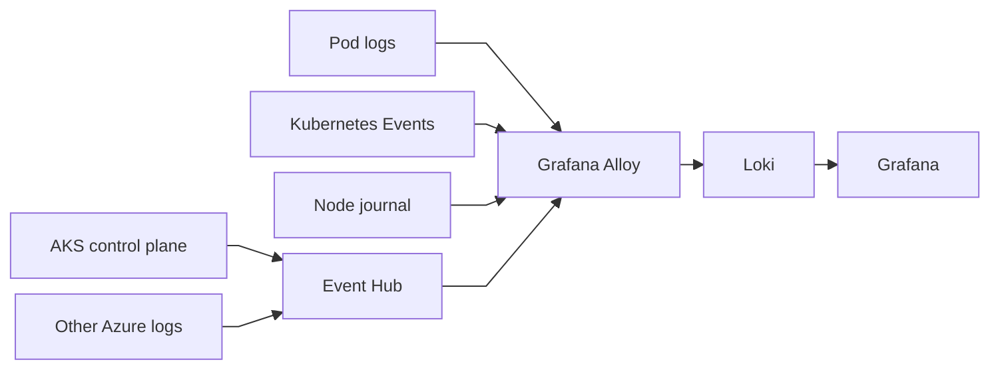
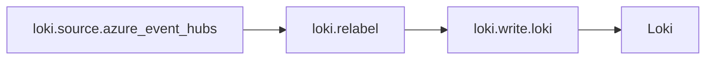

# Grafana Alloy on AKS — logging guide

## Purpose

This guide covers only logs sent directly to the shared `loki.write.loki` destination in `aks_alloy.alloy`.



## Add a log source

1. Open the required file.
2. Copy the complete file.
3. Paste it at the bottom of `aks_alloy.alloy`.
4. Replace every uppercase `<PLACEHOLDER>`.
5. Run `alloy validate aks_alloy.alloy`.
6. Deploy the completed configuration.

Replace each link placeholder after publishing the files.

| Collection | Requirement | File |
|---|---|---|
| Pod/container logs | Alloy DaemonSet; `HOSTNAME` set to node name | [Open file](<ADD_LINK_KUBERNETES_POD_LOGS>) |
| Kubernetes Events | One collector or Alloy clustering; persistent storage | [Open file](<ADD_LINK_KUBERNETES_EVENTS>) |
| Node journal | Alloy DaemonSet and host journal mounts | [Open file](<ADD_LINK_KUBERNETES_NODE_LOGS>) |
| AKS control plane | AKS Diagnostic setting and Event Hub | [Open file](<ADD_LINK_AKS_CONTROL_PLANE_LOGS>) |
| Other Azure logs | Azure Diagnostic setting and Event Hub | [Open file](<ADD_LINK_EVENT_HUB_LOGS>) |

## Pod logs and Kubernetes Events

`pod-logs.alloy` restricts API discovery to the current node. Populate `HOSTNAME` from `spec.nodeName`:

```yaml
env:
  - name: HOSTNAME
    valueFrom:
      fieldRef:
        fieldPath: spec.nodeName
```

Run `cluster-events.alloy` in one collector, or enable Alloy clustering. An unclustered DaemonSet duplicates events. Use persistent storage for Alloy's `--storage.path` to prevent event replay after restarts.

### Pod-log collection mode and scale

`loki.source.kubernetes` streams logs through the Kubernetes API.

| Mode | Benefit | Trade-off |
|---|---|---|
| Cluster-wide API collector | No host mounts | Concentrates all readers and API/Kubelet traffic |
| Node-local API DaemonSet **(current file)** | Distributes readers and prevents duplicates | Still uses Kubernetes API and Kubelets |
| Node-local file DaemonSet | Reduces pod-log API traffic | Requires `/var/log/pods` host mount and security review |

Start with the current node-local API mode. For large clusters:

1. Watch API throttling, Kubelet load and Alloy reconnects.
2. Restrict discovery to required namespaces.
3. If API load becomes material, use a dedicated `loki.source.file` DaemonSet with `/var/log/pods` mounted read-only.

Never run API and file collection for the same pods.

## Node journal

`node-journal-logs.alloy` runs once per node. Mount:

| Host path | Container path |
|---|---|
| `/var/log/journal` | `/var/log/journal` |
| `/run/log/journal` | `/run/log/journal` |

Mount both read-only. The Alloy process must have permission to read them. Journal availability and systemd unit names depend on the AKS node image.

## AKS control-plane logs

Control-plane logs are not available on worker-node filesystems:

1. Open **Azure Portal → Kubernetes services → cluster → Diagnostic settings**.
2. Add a setting and select **Stream to an event hub**.
3. Select required categories: `kube-apiserver`, `kube-audit-admin`, `kube-controller-manager`, `kube-scheduler`, `cluster-autoscaler`, `cloud-controller-manager`, `guard` and available CSI controller categories.
4. Append `aks-control-plane-logs.alloy`.

Use full `kube-audit` only when read-operation auditing is required; it produces high volume. `kube-audit-admin` focuses on modifying operations.

Replace:

| Placeholder | Source |
|---|---|
| `<AKS_EVENT_HUB_FULLY_QUALIFIED_NAMESPACE>` | Event Hub namespace host name with `:9093` |
| `<AKS_EVENT_HUB_NAME>` | Event Hub receiving AKS diagnostic logs |

## Other Azure logs through Event Hub

Append `services/event-hubs/event-hub-logs.alloy`.



Replace:

| Placeholder | Source |
|---|---|
| `<EVENT_HUB_FULLY_QUALIFIED_NAMESPACE>` | **Azure Portal → Event Hubs → namespace → Overview → Host name**; append `:9093` |
| `<EVENT_HUB_NAME>` | **Namespace → Entities → Event Hubs → event hub name** |
| `<CMDB_REFERENCE>` | Internal CMDB |
| `<AKS_RESOURCE_ID>` | **AKS → Properties → Resource ID** |

Use `<namespace>.servicebus.windows.net:9093`. Event Hubs requires Standard tier or higher for Kafka. Do not append both Event Hub files against the same hub or logs will duplicate.

## Permissions and deployment

Kubernetes RBAC:

| Resource | Verbs | Purpose |
|---|---|---|
| `pods` | `get`, `list`, `watch` | Pod discovery |
| `pods/log` | `get` | Container log streams |
| `events` | `get`, `list`, `watch` | Kubernetes Events |

For Event Hub sources:

- Assign **Azure Event Hubs Data Receiver** to the Alloy identity.
- Supply Azure credentials through Workload Identity or secret-backed environment variables.
- Permit outbound TCP 9093.

Deployment must also provide persistent `--storage.path`, node journal mounts and the `HOSTNAME` field value when their matching sources are enabled.

## Validation

Check these enabled components in the Alloy UI:

- `loki.write.loki`
- `loki.source.kubernetes.pod_logs`
- `loki.source.kubernetes_events.cluster_events`
- `loki.source.journal.node_journal`
- `loki.source.azure_event_hubs.aks_control_plane_logs`
- `loki.source.azure_event_hubs.azure_event_hub_logs`

## Troubleshooting

| Issue | Check |
|---|---|
| Pod logs absent | `pods` and `pods/log` RBAC, `HOSTNAME` and target discovery |
| Pod logs duplicated | Node-local selector, Alloy clustering and duplicate collectors |
| API or Kubelet load increases | Restrict namespaces or use file-based collection |
| Events replay | Persistent Alloy `--storage.path` |
| Node logs absent | DaemonSet placement, journal mounts and permissions |
| AKS control-plane logs absent | Diagnostic categories, Event Hub destination, role and TCP 9093 |
| Event Hub logs absent | Standard tier, namespace includes `:9093`, hub name and Data Receiver role |
| Loki export fails | Push URL, tenant ID, TLS, DNS and network access |
