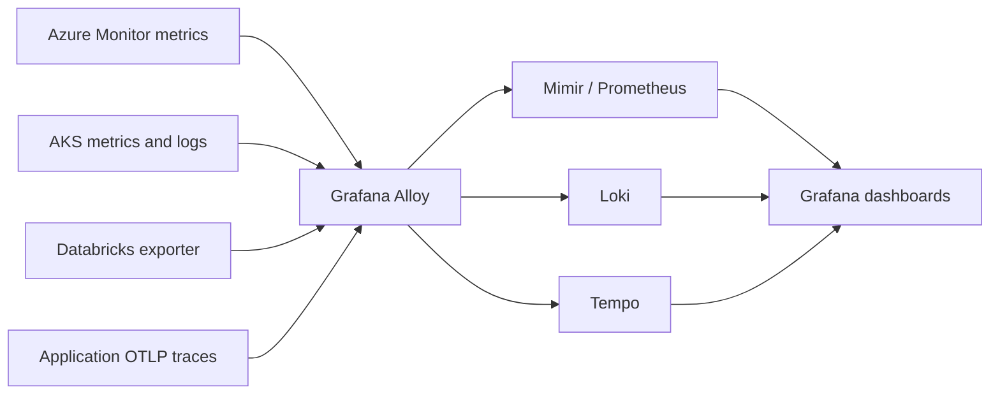

# Standard Grafana dashboard templates

Reusable operational dashboards for Azure and Kubernetes telemetry collected by
Grafana Alloy. Grafana reads metrics from Mimir/Prometheus, logs from Loki and
application traces from Tempo.

## Data flow



## Dashboard filters

| Dashboard filter | Stored label | Purpose |
|---|---|---|
| `Metrics data source` | Grafana Prometheus data source | Select Mimir/Prometheus |
| `Logs data source` | Grafana Loki data source | Select Loki |
| `Traces data source` | Grafana Tempo data source | Select Tempo |
| `CMDB_REFERENCE` | `cmdbReference` | Select application or CMDB ownership code |
| `Service name` | `service_name` | Select Alloy service/job identity |
| `Azure resource` | `resource_name` | Select an individual Azure resource |
| `Kubernetes namespace` | `k8s_namespace_name` or `namespace` | Select AKS namespace |

`CMDB_REFERENCE` and `Service name` are multi-value filters available across the
templates. Dependent filters only show values matching the selections before
them. Loki uses `cmdbReference` and `job`, matching labels created by the Alloy
log pipeline.

The three data source filters are available on every dashboard. Select the
production Mimir/Prometheus, Loki and Tempo data sources after import.

## Dashboard layout

Most Azure service dashboards contain:

1. Six current-value KPI panels.
2. Six matching time-series panels, split by Azure resource.
3. Azure resource inventory showing `CMDB_REFERENCE`, service, resource name,
   resource group, resource type and region.
4. Related log volume and searchable logs from Loki.
5. Related application trace rate and recent traces from Tempo.

Templates provide standard overview views. They are not alert rules. Detailed
diagnostic or team-specific panels can be added without changing the standard
top section.

## Dashboard catalog

| Dashboard | What it shows |
|---|---|
| Standard Dashboard Templates | Template navigation, reporting services/resources, Azure scrape health, Alloy metric throughput and AKS CPU/memory |
| Virtual Machines | CPU, available memory, disk latency, queue depth and disk read/write bytes |
| SQL Database | CPU, DTU, storage, deadlocks, failed connections and availability |
| SQL Managed Instance | CPU, used/reserved storage, read/write bytes and I/O requests |
| Service Bus | Active and dead-letter messages, incoming/outgoing messages, namespace CPU and send latency |
| Event Hubs | Incoming/outgoing messages and bytes, throttled requests and server errors |
| Event Grid | Publish success/failure, dead-letter and delivery counts, publish latency and destination processing time |
| Logic Apps Consumption | Started/succeeded/failed runs, failure percentage, latency and throttling |
| Logic Apps Standard | CPU time, memory, HTTP latency/5xx, workflow failure rate and job duration |
| Azure Cache for Redis | Operations, server load, clients, memory, cache hits and misses |
| Cosmos DB | RU consumption, throughput, server latency, availability, requests and request units |
| Azure Databricks | Exporter health, 24-hour DBU usage, job runs, SLA misses, SQL query errors and pipeline freshness lag |
| Storage Accounts | Availability, ingress/egress, latency, transactions and used capacity |
| Azure Files | Availability, capacity, IOPS/bandwidth utilization, latency and transactions |
| Blob Storage | Availability, capacity, blob count, ingress, latency and transactions |
| AKS / Kubernetes | Containers, CPU, memory, filesystem, restarts, replicas and pods not ready |
| Kubernetes and Platform Logs | Alloy log pipeline health, log volume, errors and searchable Loki streams |

## Data requirements

- `prometheus.exporter.azure` must collect metrics listed by each matching
  service snippet.
- Azure exporter metric names must use its default
  `azure_{type}_{metric}_{aggregation}_{unit}` format.
- Azure metric series must retain `resource_name`, `resource_group`,
  `resource_type` and `region`.
- Enrichment must add `cmdbReference` and `service.name`; Prometheus exposes the
  latter as `service_name`.
- Databricks uses Alloy's Databricks exporter, not Azure Monitor metrics. The
  exporter queries Unity Catalog System Tables through a SQL Warehouse and must
  expose the official `databricks_*` sliding-window metrics used by the
  dashboard. See the
  [Databricks collection guide](../services/azure-monitor/DATABRICKS.md).
- cAdvisor and kube-state-metrics must provide AKS metrics.
- Kubernetes and platform log streams must contain `cmdbReference` and `job`.
- Application OTLP traces must contain resource attributes
  `cmdbReference` and `service.name`.

Azure Monitor does not emit application traces. Trace panels show application
traces sent through Alloy to Tempo and correlate them to Azure metrics using
`cmdbReference`. Log and trace panels show `No data` when those signals are not
collected or do not contain the correlation attribute.

Missing labels do not break Grafana, but affected filters and resource inventory
columns will be empty. Missing metrics produce `No data` panels.

## Datasources

Default datasource UIDs:

| Signal | Default UID |
|---|---|
| Metrics | `prometheus` |
| Logs | `loki` |
| Traces | `tempo` |

These are only initial selections. Use the dashboard data source filters to
select production data sources without editing the JSON.

## Generate JSON

```bash
python azure-alert-migration/dashboard-templates/build_dashboard_templates.py
```

Generated files are written to `dashboard-templates/dashboards/`. Edit the
generator, then regenerate; do not maintain generated JSON separately.

## Provision to Grafana

```bash
python azure-alert-migration/dashboard-templates/build_dashboard_templates.py --provision
```

Defaults:

- Grafana URL: `http://localhost:3000`
- Grafana folder: `Standard Dashboard Templates`

For another Grafana instance, set `GRAFANA` and `GRAFANA_API_TOKEN`.
Provisioning overwrites dashboards with matching UIDs.

## Validation data

`test-data/` creates isolated visual-validation telemetry. Values are generated
and must never be treated as Azure measurements.

```bash
docker build -t dashboard-template-test-data:v1 azure-alert-migration/dashboard-templates/test-data
kind load docker-image dashboard-template-test-data:v1 --name otel-compare
kubectl apply -f azure-alert-migration/dashboard-templates/test-data/k8s.yaml
```

## References

- [Grafana Alloy Azure exporter](https://grafana.com/docs/alloy/latest/reference/components/prometheus/prometheus.exporter.azure/)
- [Azure Monitor supported metrics](https://learn.microsoft.com/azure/azure-monitor/reference/metrics-index)
